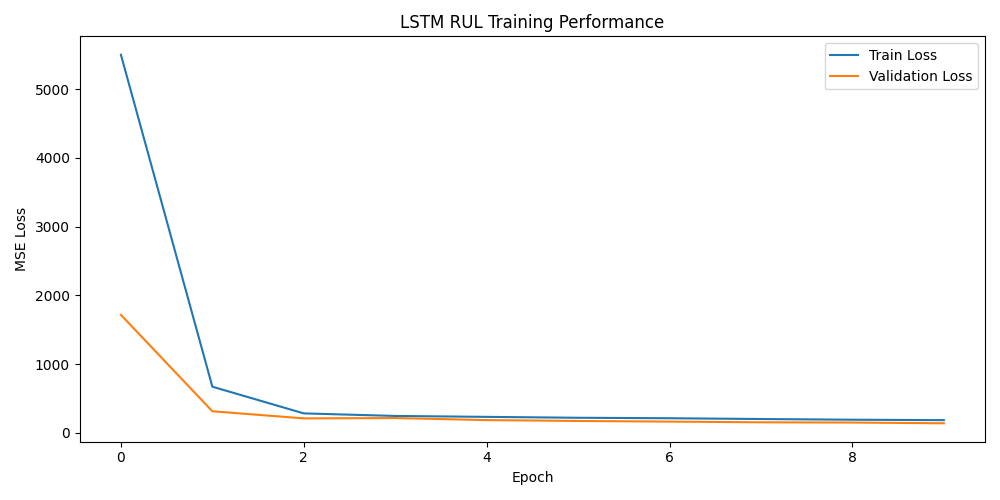

# ✈️ Aerospace Remaining Useful Life Prediction System  
**Predictive maintenance system for turbofan engines using LSTM-based time-series forecasting on NASA C-MAPSS degradation data.**

## 📌 Project Overview
This project implements a deep learning–based Remaining Useful Life (RUL) prediction system for turbofan engines using NASA’s C-MAPSS degradation dataset.

A multi-layer Long Short-Term Memory (LSTM) neural network was developed to model temporal sensor degradation patterns and estimate the number of operational cycles remaining before engine failure.

The project simulates predictive maintenance decision-making by converting model predictions into structured maintenance priority tiers.

## 🧠 Problem Statement
Aircraft engines degrade gradually over time. Predicting Remaining Useful Life (RUL) enables:
- Early failure detection
- Maintenance cost reduction
- Operational risk mitigation
- Predictive maintenance optimization

## 📊 Dataset
- Source: NASA C-MAPSS Turbofan Engine Degradation Dataset
- Multivariate sensor readings over operational cycles
- Multiple engine units with varying failure patterns
- Supervised regression target: Remaining Useful Life (RUL)

## 🏗 Model Architecture
- Multi-layer LSTM network
- Sliding-window sequence generation
- Standardized sensor feature scaling
- Fully connected output layer for regression
- Mean Squared Error (MSE) loss function
- Adam optimizer for convergence

## 🔄 Data Processing Pipeline
1. Load raw turbofan sensor dataset
2. Standardize sensor values
3. Generate sliding-window sequences
4. Construct RUL targets
5. Train/test split
6. Model training and evaluation

## ⚙️ Maintenance Simulation Logic
After generating RUL predictions, post-processing logic categorizes engines into:
- High Risk
- Medium Risk
- Low Risk

The model outputs structured JSON-based maintenance event simulations to demonstrate how predictions could support enterprise maintenance decision workflows.

## 📈 Evaluation
- Regression performance measured using Mean Squared Error (MSE)
- Visualization of predicted vs actual RUL
- Trend analysis across degradation cycles

 ## 📉 Training Visualization

 

## 🛠 Technologies Used
- Python
- PyTorch
- NumPy
- Pandas
- Matplotlib

## 📂 Project Structure
aerospace-rul-prediction/
├── data/
│   └── train_FD001.txt
├── models/
│   ├── lstm_rul_fd001.pt
│   ├── scaler_fd001.joblib
│   └── meta_fd001.json
├── outputs/
│   └── training_curve.png
├── scripts/
│   └── train.py
├── src/
│   ├── preprocess.py
│   ├── build_sequences.py
│   ├── model.py
│   └── infer_and_generate_workorders.py
├── requirements.txt
└── README.md    

## ▶️ How to Run

```bash
python -m venv .venv
source .venv/bin/activate

pip install -r requirements.txt

python -m scripts.train
python -m src.infer_and_generate_workorders
```

## 🚀 Future Improvements
- Hyperparameter tuning
- Bidirectional LSTM experimentation
- Transformer-based time-series modeling
- Deployment as REST API
- Real-time streaming inference pipeline

## 🎯 Key Takeaways
- Applied sequence-based deep learning for real-world predictive maintenance
- Implemented modular ML pipeline for maintainability
- Translated model outputs into structured operational decisions
- Demonstrated applied knowledge of LSTM architectures and time-series modeling

