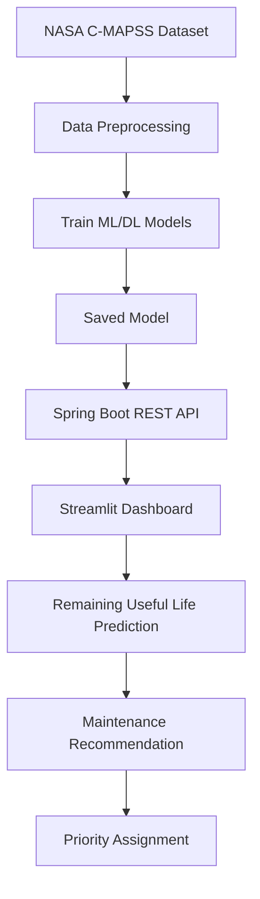
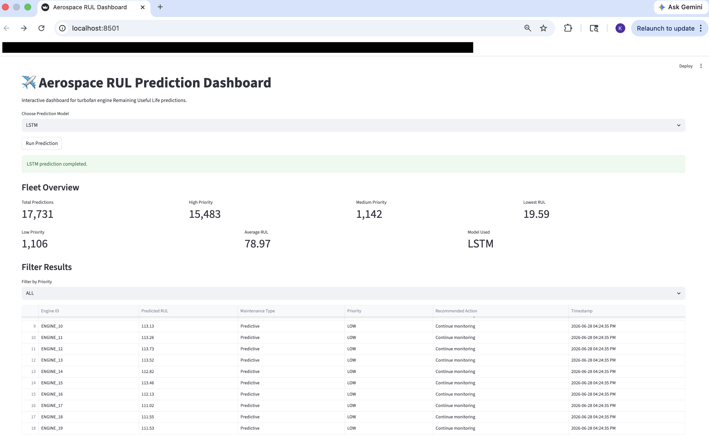
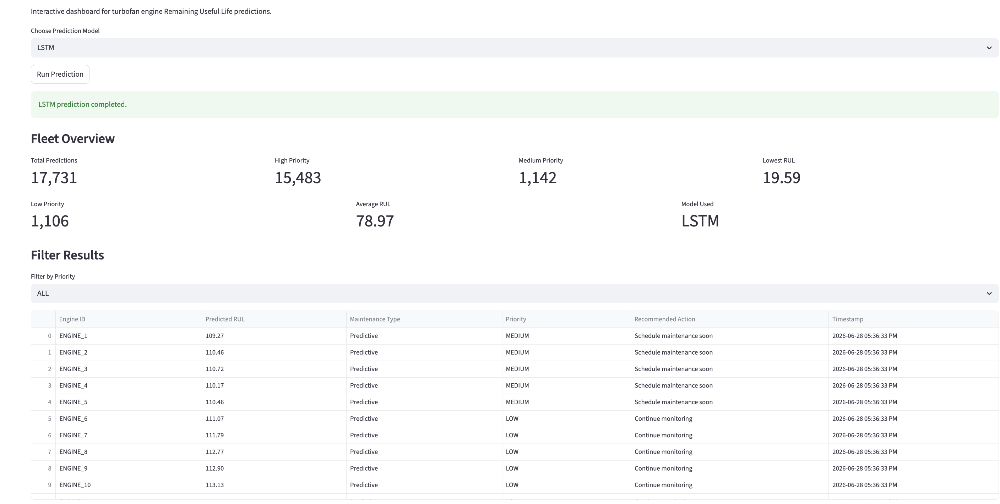
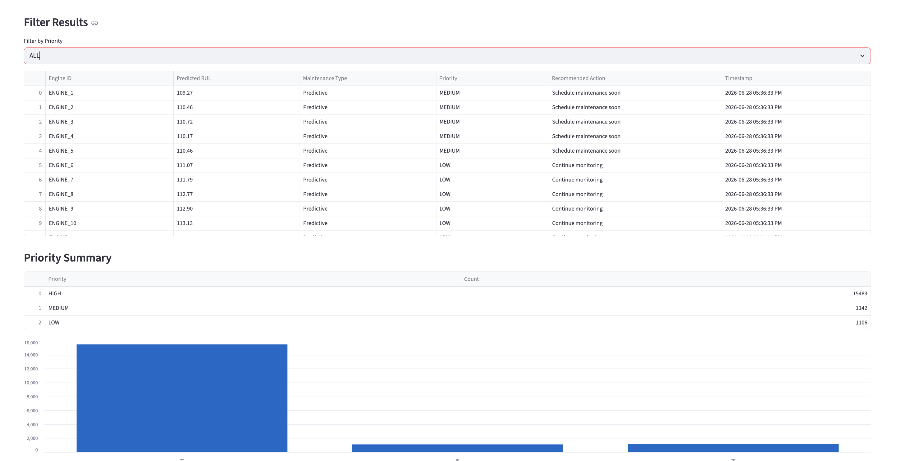

# ✈️ Aerospace Remaining Useful Life Prediction System

Predictive maintenance platform that estimates aircraft engine Remaining Useful Life (RUL) using multiple machine learning and deep learning models trained on NASA's C-MAPSS turbofan engine degradation dataset.

---

# ⭐ Project Highlights

- ✈️ Trained predictive maintenance models using NASA's C-MAPSS turbofan engine dataset
- 🤖 Supports five prediction models (LSTM, GRU, SimpleRNN, Random Forest, Linear Regression)
- ⚙️ Developed a Spring Boot REST API for maintenance predictions
- 📊 Built an interactive Streamlit dashboard for model comparison
- 🔧 Generates priority-based maintenance recommendations
- 📈 Predicts Remaining Useful Life (RUL) for aircraft engines
- 🍎 Optimized model training using Apple Silicon (MPS)
- 📦 Supports both Conda and pip environments

---

# 🚀 Project Overview

This project predicts the Remaining Useful Life (RUL) of aircraft turbofan engines by analyzing operational settings and sensor telemetry collected throughout an engine's lifecycle.

The application simulates a real-world predictive maintenance workflow by:

- Forecasting engine degradation
- Estimating remaining operational cycles
- Comparing multiple machine learning models
- Generating maintenance recommendations
- Assigning maintenance priorities
- Delivering predictions through a Spring Boot REST API and Streamlit dashboard

The objective is to demonstrate how machine learning can support predictive maintenance planning, reduce unexpected failures, and improve fleet reliability.

---

# 🤖 Supported Prediction Models

| Model | Category |
|--------|----------|
| LSTM | Deep Learning |
| GRU | Deep Learning |
| SimpleRNN | Deep Learning |
| Random Forest | Ensemble Learning |
| Linear Regression | Statistical Learning |

The dashboard allows users to switch between prediction models and compare their outputs.

---

# 📊 Dataset

**NASA C-MAPSS Turbofan Engine Degradation Dataset**

Dataset includes:

- Operational settings
- Engine sensor measurements
- Engine cycle history
- Simulated degradation patterns

This dataset is widely used for predictive maintenance and Remaining Useful Life (RUL) forecasting research.

---

# 🏗️ System Architecture



---

# ⚙️ Technology Stack

### Machine Learning

- Python
- PyTorch
- Scikit-Learn
- NumPy
- Pandas

### Backend

- Java
- Spring Boot
- Maven

### Dashboard

- Streamlit

### Development

- Git
- GitHub
- VS Code

---

# 🔧 Key Features

- Multi-model prediction system
- Predictive maintenance recommendations
- Priority-based work order generation
- Interactive dashboard
- REST API integration
- JSON maintenance alert generation
- Real-time prediction workflow
- Model comparison dashboard

---

# 📈 Model Outputs

The system generates:

- Remaining Useful Life (RUL)
- Maintenance Priority
- Recommended Maintenance Action
- Maintenance Category
- Timestamped Prediction Results

The dashboard allows side-by-side comparison of multiple machine learning and deep learning models.

---

# 📄 Example Output

```json
{
  "asset_id": "ENGINE_1",
  "predicted_rul": 129.75,
  "maintenance_type": "Predictive",
  "priority": "LOW",
  "recommended_action": "Continue monitoring"
}
```

---

# 📸 Dashboard Screenshots

## 🚀 Interactive Dashboard

Interactive Streamlit dashboard allowing users to select prediction models, generate Remaining Useful Life (RUL) forecasts, review fleet metrics, and visualize maintenance priorities.




---

## 📈 Fleet Predictions

Displays predicted Remaining Useful Life (RUL), maintenance priorities, recommended maintenance actions, and timestamped prediction results.



---

## 🚨 Maintenance Priority Filtering

Filter prediction results by maintenance priority to quickly identify aircraft engines requiring immediate maintenance attention.



---

# 🚀 Environment Setup

## Prerequisites

- Python 3.11
- Conda (Miniconda or Anaconda)

---

## Clone Repository

```bash
git clone https://github.com/loveLaceLogic/aerospace-rul-prediction.git
cd aerospace-rul-prediction
```

---

## Create Conda Environment

```bash
conda env create -f environment.yml
```

---

## Activate Environment

```bash
conda activate aerospace-rul
```

---

## Train Models

```bash
python -m scripts.train
```

---

## Launch Dashboard

```bash
streamlit run dashboard/app.py
```

---

# 🚀 Future Improvements

- Deploy dashboard to the cloud
- Add XGBoost and LightGBM prediction models
- Integrate live maintenance scheduling
- Containerize using Docker
- Add CI/CD with GitHub Actions
- Support additional NASA C-MAPSS datasets
